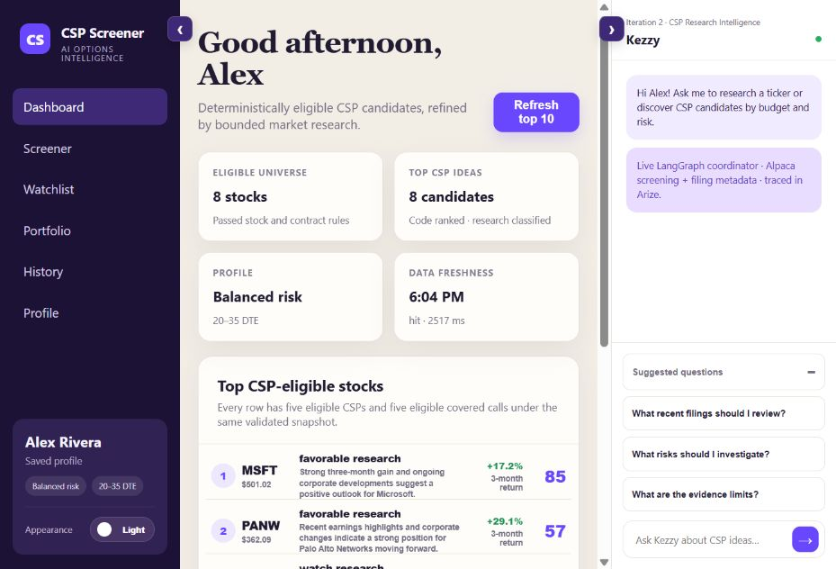
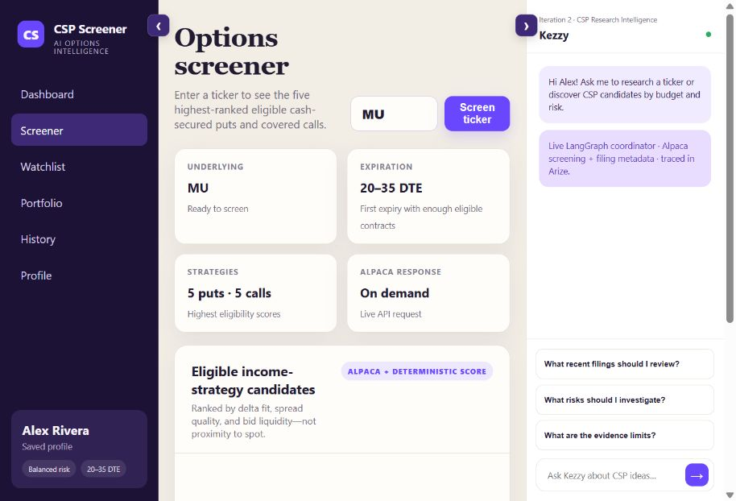
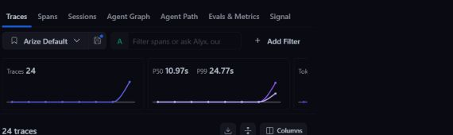
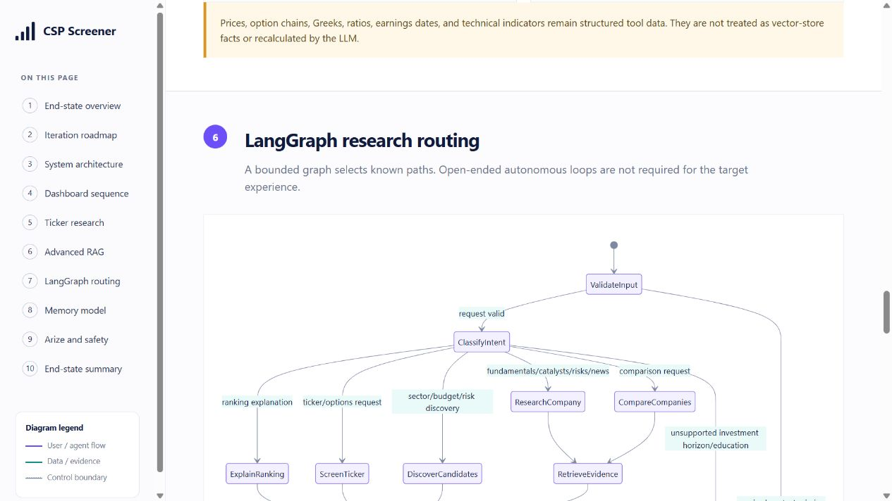

# CSP Screener Capstone

A capstone application for screening stocks and options for cash-secured-put (CSP) research. It combines deterministic eligibility and ranking calculations with Alpaca market data, Yahoo research tools exposed through a local MCP server, an optional LangChain/LangGraph research agent, and Arize tracing.

The application is research-only: it does not place trades or provide personalized financial advice.

## What the demo does

- Maintains a dashboard of up to ten fully CSP-eligible candidates from a configured universe.
- Screens any ticker and displays the five highest-ranked eligible cash-secured puts and covered calls.
- Calculates affordability, strike distance, premium yield, volatility, liquidity, and other ranking inputs deterministically.
- Lets the research agent answer ticker, comparison, budget, risk, and follow-up questions using current screen results as grounded context.
- Refreshes dashboard data in the background and caches the latest result.
- Exports LangChain/LangGraph traces to Arize when Arize credentials are configured.
- Includes a CLI for measuring Alpaca stock and option-data latency.

## Demo screenshots

### Dashboard: eligible CSP shortlist



### Ticker screener: ranked option contracts



### Arize: workflow traces



### LangGraph: bounded research routing



## Architecture

Review the pending end-state design in either format:

- [GitHub-rendered architecture and Mermaid diagrams](docs/ARCHITECTURE.md)
- [Single-page HTML architecture review](docs/architecture-review.html)

## Development workstreams

The project is organized into independent workstreams with clear component boundaries:

| Workstream | Responsibility | Primary paths | Stable interface |
|---|---|---|---|
| Market data | Alpaca API/MCP adapters, normalization, latency | `src/csp_screener/providers/` | `latest_trade`, `option_chain`, `daily_bars` |
| CSP ranking | Eligibility rules, scoring, contract selection | `src/csp_screener/iteration1.py`, `src/csp_screener/workflows/` | `IterationOneWorkflow.screen/options` |
| Research agent | Intent routing, RAG, follow-ups, memory | `src/csp_screener/iteration2.py`, `src/csp_screener/agents/` | `ResearchAgent.ask` |
| Observability/evals | Arize spans, datasets, regression metrics | `src/csp_screener/observability.py`, `tests/` | Trace names and evaluation fixtures |
| Application/API | Cache, scheduler, validation, API contracts | `src/csp_screener/services/`, `src/csp_screener/server.py` | `/api/screen`, `/api/options`, `/api/chat` |
| Frontend | Dashboard, screener, profile and chat UX | `web/` | API response contracts |
| QA/deployment | Integration tests, fixtures, hosting and runbooks | `tests/`, `docs/`, deployment configuration | Release checks |

Detailed flows and component boundaries are documented in [docs/ARCHITECTURE.md](docs/ARCHITECTURE.md).

## Repository layout

```text
capstone/
├── src/csp_screener/
│   ├── agents/             # Public research-agent interface
│   ├── providers/          # External market-data adapters
│   ├── services/           # Application orchestration and caching
│   ├── workflows/          # Public workflow interfaces
│   ├── config.py           # Centralized runtime configuration
│   ├── iteration1.py       # Deterministic CSP workflow
│   ├── iteration2.py       # LangGraph research workflow
│   ├── observability.py    # Arize/OpenTelemetry setup
│   ├── server.py           # Thin HTTP transport
│   └── cli.py              # Alpaca latency benchmark CLI
├── web/                    # Vanilla HTML, CSS and JavaScript UI
├── tests/
│   ├── unit/              # Fast tests grouped by component boundary
│   └── integration/       # Cross-component workflow tests
├── docs/                   # Architecture and component specifications
├── .env.example            # Safe configuration template
└── pyproject.toml          # Python package and dependencies
```

Tests mirror the application boundaries (`domain`, `agents`, `services`,
`retrieval`, `configuration`, and `observability`) so contributors can work on
one component without mixing its fixtures and assertions with another.

## Prerequisites

- Python 3.11 or newer
- Git
- An Alpaca Market Data API key and secret
- Optional: an OpenAI API key for live agent responses
- Optional: a Tavily API key for chat news retrieval
- Optional: Arize space/API credentials for hosted tracing

## Get the API credentials

Only Alpaca is required for the deterministic dashboard and ticker screener. OpenAI
enables CSP Research Intelligence. Tavily enables chat news retrieval. Arize enables
hosted traces.

| Service | Required? | Where to get it | Environment variables |
|---|---|---|---|
| Alpaca Market Data | Yes | Create an Alpaca account, open the developer/paper dashboard, and generate an API key pair. See [Alpaca authentication](https://docs.alpaca.markets/us/v1.1/docs/authentication-1) and [paper trading setup](https://docs.alpaca.markets/us/docs/paper-trading). | `ALPACA_API_KEY`, `ALPACA_SECRET_KEY` |
| OpenAI API | For research/chat | Create a project API key from the [OpenAI API key page](https://platform.openai.com/api-keys). API billing is separate from a ChatGPT subscription; follow the [OpenAI developer quickstart](https://platform.openai.com/docs/quickstart/make-your-first-api-request). | `OPENAI_API_KEY`, `OPENAI_MODEL` |
| Tavily | For chat news | Create an API key from the [Tavily dashboard](https://app.tavily.com/). Chat options questions still use Alpaca when this is blank. | `TAVILY_API_KEY` |
| Arize AX | For hosted tracing | Create or open an Arize AX space, then go to **Settings → API Keys**. Copy the Current Space ID and generate an API key. See the [Arize tracing quickstart](https://arize.com/docs/ax/quickstarts). | `ARIZE_SPACE_ID`, `ARIZE_API_KEY`, `ARIZE_PROJECT_NAME` |

Keep all credentials in the local `.env` file. Do not paste them into source files,
browser JavaScript, issues, chat messages, or commits.

## Quick setup

### 1. Clone the repository

```bash
git clone https://github.com/SaiKalyan124/csp-screener-capstone.git
cd csp-screener-capstone
```

### 2. Create a virtual environment

Windows PowerShell:

```powershell
py -3.11 -m venv .venv
.venv\Scripts\Activate.ps1
```

macOS or Linux:

```bash
python3 -m venv .venv
source .venv/bin/activate
```

### 3. Install the project

```bash
python -m pip install --upgrade pip
python -m pip install -e ".[dev]"
```

### 4. Configure credentials

Windows PowerShell:

```powershell
Copy-Item .env.example .env
```

macOS or Linux:

```bash
cp .env.example .env
```

Edit `.env`:

```dotenv
ALPACA_API_KEY=your_market_data_key
ALPACA_SECRET_KEY=your_market_data_secret

# Optional: enables CSP Research Intelligence and chat
OPENAI_API_KEY=
OPENAI_MODEL=gpt-5-mini

# Optional: chat news retrieval via the local Tavily MCP server
TAVILY_API_KEY=

# Optional: exports LangChain/LangGraph traces to Arize AX
ARIZE_SPACE_ID=
ARIZE_API_KEY=
ARIZE_PROJECT_NAME=csp-screener-capstone
```

The minimum working `.env` contains the two Alpaca values. Leave optional values
blank if you only want to run the deterministic dashboard and ticker screener.
If `gpt-5-mini` is unavailable to your OpenAI project, replace it with a compatible
model listed for that project.

Never commit `.env`. It is already excluded by `.gitignore`.

If credentials must be shared from another local file, set `CSP_SHARED_ENV_FILE` to that file's path before starting the application. A repository-local `.env` remains the recommended setup.

### 5. Run the tests

```bash
python -m pytest -q
```

### 6. Start the web application

```bash
python -m csp_screener.server
```

Alternatively, after installation:

```bash
csp-demo
```

Open [http://127.0.0.1:8080](http://127.0.0.1:8080).

### 7. Verify the running setup

Keep the server running and open a second terminal.

Windows PowerShell:

```powershell
$result = Invoke-RestMethod "http://127.0.0.1:8080/api/options?symbol=MU"
$result.symbol
$result.contracts.Count
```

macOS or Linux:

```bash
curl -fsS "http://127.0.0.1:8080/api/options?symbol=MU" | python -m json.tool
```

A working Alpaca setup returns `MU` and an option-contract list. To verify the
optional agent, ask a ticker question in the right-side chat. To verify Arize,
make a chat request and confirm a new trace appears in the configured Arize project.

## API endpoints

| Method | Endpoint | Purpose |
|---|---|---|
| `GET` | `/api/screen` | Return cached dashboard candidates |
| `GET` | `/api/screen?refresh=1` | Force a fresh dashboard screen |
| `GET` | `/api/options?symbol=MU` | Return the selected ticker's option candidates |
| `POST` | `/api/chat` | Ask the research agent a ticker-specific question |

Example chat request:

```json
{
  "symbol": "MU",
  "question": "Give me three CSP candidates that fit a $50,000 budget."
}
```

## Alpaca latency benchmark

Run the default benchmark:

```bash
csp-benchmark --runs 5 --warmups 1
```

Limit the option request to a strike and expiration window:

```bash
csp-benchmark --underlying SPY --strike-low 550 --strike-high 750 --dte-min 7 --dte-max 30 --runs 10
```

Reports are appended to `results/benchmarks.jsonl`. Compare minimum, median, and p95 latency; the first call may include connection setup.

## Course workflow smoke test

```bash
python -m csp_screener.course_e2e
```

This exercises LangGraph routing, Yahoo MCP evidence retrieval, LangChain invocation, and OpenTelemetry tracing. With Arize credentials, traces are exported to Arize. Without an OpenAI key, the smoke test uses a deterministic fake chat model.

## Development workflow

1. Choose one workstream and avoid mixing unrelated component changes.
2. Create a feature branch: `git switch -c feature/<short-description>`.
3. Preserve the stable interface listed in the workstream table, or coordinate the contract change first.
4. Add focused tests for the component being changed.
5. Run `python -m pytest -q` before opening a pull request.
6. In the pull request, describe changed contracts, test evidence, UI screenshots when relevant, and any new environment variables.

## Troubleshooting

### Alpaca credentials are missing

Confirm `.env` exists in the repository root and contains `ALPACA_API_KEY` and `ALPACA_SECRET_KEY`. Alpaca-compatible names `APCA_API_KEY_ID` and `APCA_API_SECRET_KEY` are also accepted.

### PowerShell blocks environment activation

Activation is optional. Run commands through the environment directly:

```powershell
.venv\Scripts\python.exe -m pip install -e ".[dev]"
.venv\Scripts\python.exe -m pytest -q
.venv\Scripts\python.exe -m csp_screener.server
```

### Port 8080 is already in use

Stop the existing local process using that port, then start the application again.

### The agent has no live model response

Add `OPENAI_API_KEY` to `.env` and confirm `OPENAI_MODEL` is available to that
OpenAI project. API access and billing are separate from a ChatGPT subscription.
Deterministic screening and Alpaca option data do not require OpenAI.

### Dashboard refresh returns a connection error or HTTP 502

Confirm the computer can reach Alpaca, the two Alpaca values are correct, and no
VPN, proxy, firewall, or restricted runtime is blocking outbound network access.
Restart the server after changing `.env`.

### No Arize traces appear

Verify `ARIZE_SPACE_ID`, `ARIZE_API_KEY`, and `ARIZE_PROJECT_NAME`, then restart
the server and run the course smoke test or make a chat request. In Arize, check
the selected project, environment, and time range. Without Arize credentials,
traces are printed locally instead of exported.

## Security and data notes

- Credentials stay on the Python server and are never sent to the browser.
- Do not commit `.env`, trace exports containing sensitive prompts, or private portfolio data.
- Market-data availability depends on Alpaca account entitlements.
- Scores and eligibility rules are capstone examples and must be evaluated before real-world use.

## Documentation

- [Architecture and iteration flows](docs/ARCHITECTURE.md)
- [Market data and screening](docs/components/MARKET_DATA_AND_SCREENING.md)
- [Research agent and RAG](docs/components/RESEARCH_AGENT_AND_RAG.md)
- [Application API and UI](docs/components/APPLICATION_API_AND_UI.md)
- [Observability, evaluations, and safety](docs/components/OBSERVABILITY_EVALUATIONS_AND_SAFETY.md)
