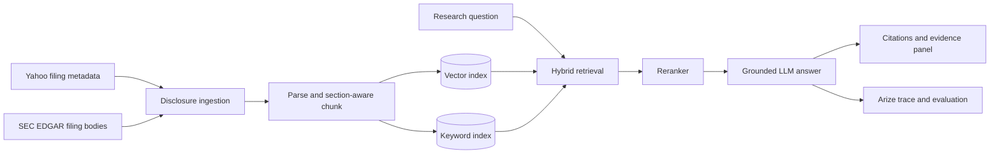
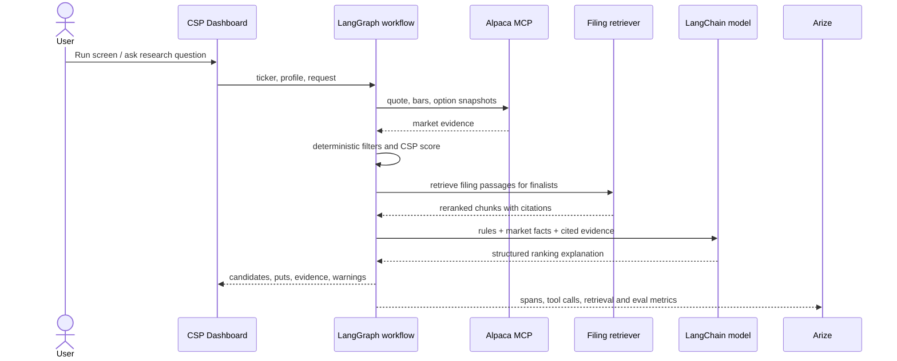

# Advanced RAG implementation plan

## Evidence design

Yahoo Finance is a discovery and enrichment source, not the authoritative RAG corpus. `yfinance.Ticker.get_sec_filings()` supplies recent filing metadata and links; Yahoo also supplies news, statements, valuation measures, and price context. The ingestion service follows those links to SEC EDGAR and stores the filing body used for grounded answers.

### Retrieval contract

Each chunk carries `ticker`, `accession_number`, `form_type`, `filed_at`, `report_period`, `section`, `source_url`, `retrieved_at`, and a content hash. Retrieval combines semantic similarity and keyword/BM25 results, deduplicates by accession and section, then reranks the candidate set. Every generated claim must refer to returned chunk IDs and expose source links in the UI.

### Initial evaluation set

- Find the latest 10-Q risk-factor change for a known ticker.
- Identify liquidity or debt language from a cited filing section.
- Reject a question when the indexed filings do not support an answer.
- Prefer a newer disclosure when two filings conflict.
- Never present Yahoo metadata or a news headline as if it were filing-body evidence.

Track retrieval recall@k, citation precision, groundedness, answer relevance, latency by node, token use, and estimated cost in Arize. Keep option calculations and eligibility rules deterministic; use the model for research synthesis and explanation.

## End-to-end workflow

## Parallel implementation workstreams

| Owner | Component | First deliverable | Stable interface | Acceptance test |
|---|---|---|---|---|
| 1 | Alpaca MCP gateway | MCP client for quotes, bars, contracts, snapshots | `MarketDataProvider` DTOs | MU request returns timestamped data; no secret reaches browser |
| 2 | CSP ranking engine | Deterministic stock and put scoring | `rank_candidates(inputs) -> scored[]` | Golden fixtures reproduce scores and rejection reasons |
| 3 | Disclosure ingestion | Yahoo discovery plus SEC filing fetch/parser | `ingest(ticker) -> documents[]` | Latest filing stored with accession, section, URL, hash |
| 4 | Advanced retrieval | Chunking, embeddings, keyword index, fusion, reranker | `retrieve(query, ticker, k) -> chunks[]` | Evaluation queries meet agreed recall@k and return citations |
| 5 | LangGraph and Kezzy | Bounded workflow, routing, structured responses | Graph state and Pydantic response schema | Unsupported claims abstain; tool failures degrade visibly |
| 6 | Arize and evaluations | Tracing, datasets, evaluators, dashboard | Trace attributes and evaluation report | One run shows node latency, retrieval, model, tokens, result |
| 7 | UI, API, scheduler, integration | Dashboard freshness, evidence drawer, scheduled refresh | REST endpoints plus run-status schema | Refresh is atomic; stale badge and last-success time are accurate |

## Integration order

1. Freeze shared DTOs, sample fixtures, and the graph state contract.
2. Owners 1–7 implement against fixtures in parallel.
3. Connect market gateway and filing retrieval to the graph.
4. Add Arize traces and run the evaluation dataset before UI polish.
5. Turn on scheduled refresh only after idempotency, timeout, and last-known-good behavior pass.

## Definition of done for Iteration 1

- Dashboard ranks ten CSP-eligible stocks using deterministic, documented inputs.
- Ticker screen returns five candidate cash-secured puts and clearly labels calls as covered calls, not cash-secured calls.
- At least one research answer retrieves and cites actual SEC filing text.
- A full LangGraph run is visible in Arize with retrieval and model spans.
- Failure, stale-data, and missing-evidence states are visible and tested.
- Credentials remain server-side and no order is submitted.
