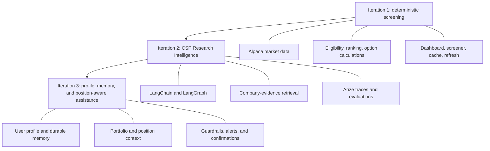
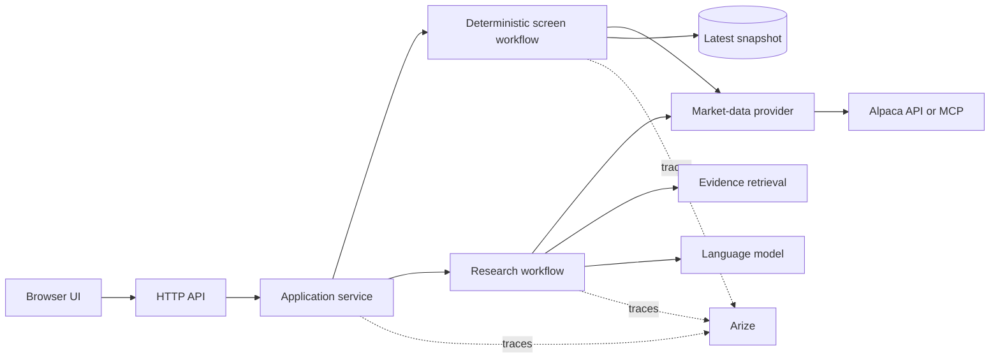
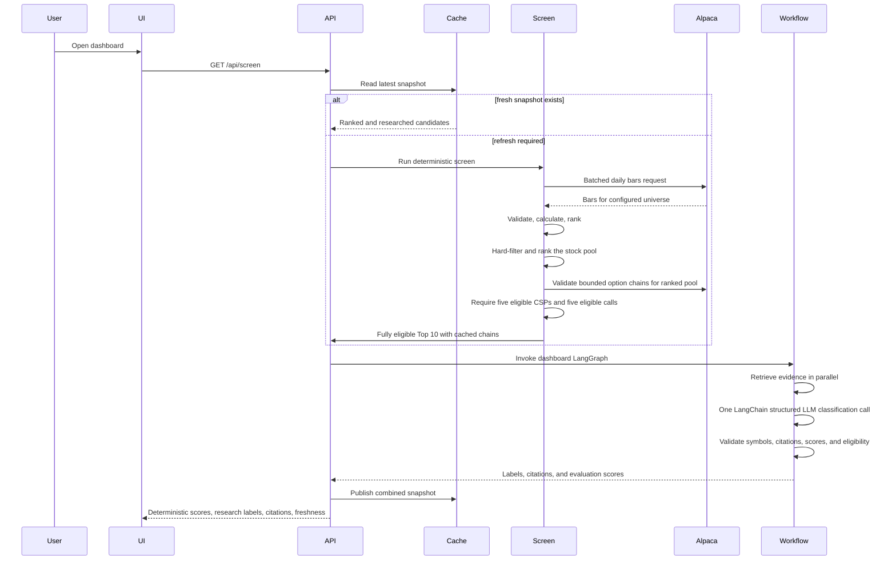
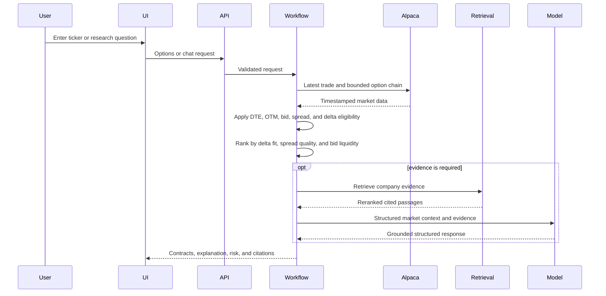

# CSP Screener architecture

For a navigable single-page visual review, see [architecture-review.html](architecture-review.html). This HTML artifact presents the same target architecture with current and planned components distinguished explicitly.

## Iteration model

Iteration 1 owns all numerical calculations. Iteration 2 classifies the deterministically eligible Top 10 as favorable, watch, avoid, or insufficient evidence using bounded retrieved research. It may change display order within that shortlist but cannot make an ineligible candidate eligible or rewrite a numerical score. Iteration 3 adds personalization without changing those trust boundaries.

## High-level component flow

## Dashboard sequence

## Ticker and research sequence

## Cross-cutting rules

- External data must retain source and freshness timestamps.
- Failed refreshes never replace the last successful snapshot.
- Trading and account-modification tools are outside the allowed capability set.
- Secrets stay in server-side environment variables and are excluded from traces.
- Every numerical claim must trace to deterministic state or provider output.
- Dashboard research is a bounded classification layer after eligibility; failure preserves the deterministic Top 10 and is shown as a fallback.
- Each component exposes a stable interface and remains independently testable.

## Component documents

- [Market data and screening](components/MARKET_DATA_AND_SCREENING.md)
- [Research agent and RAG](components/RESEARCH_AGENT_AND_RAG.md)
- [Application API and UI](components/APPLICATION_API_AND_UI.md)
- [Observability, evaluations, and safety](components/OBSERVABILITY_EVALUATIONS_AND_SAFETY.md)
