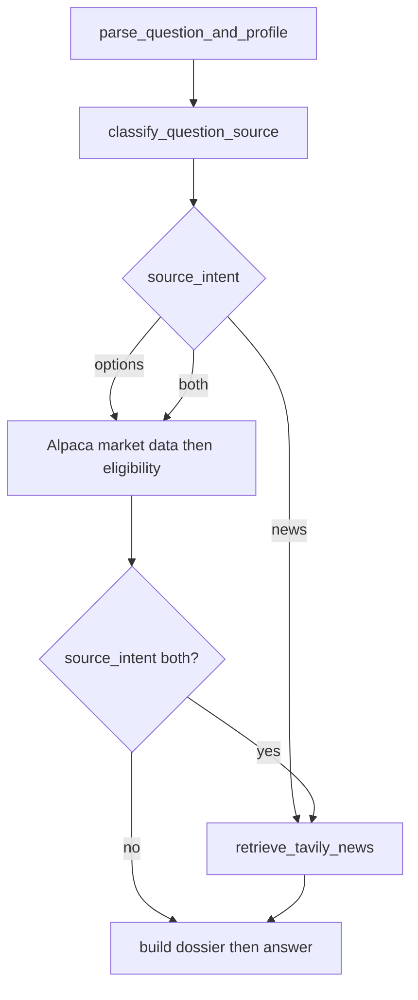
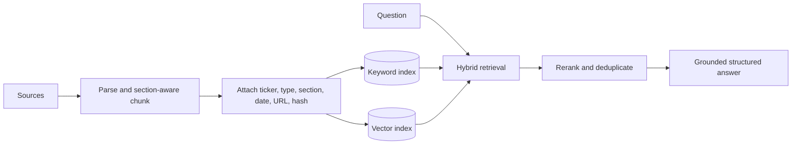

# CSP Research Intelligence and RAG

## Responsibility

This component interprets research questions, selects a bounded workflow, retrieves relevant company evidence, and produces structured answers grounded in deterministic market context and citations.

## Usage paradigm

Iteration 2 is a bounded workflow agent, not an unrestricted autonomous agent. LangGraph controls routing and state; LangChain supplies model, tool, retrieval, and structured-output integrations.

Supported routes include:

- explain a ticker or ranked candidate;
- compare supplied tickers;
- discover affordable CSP candidates;
- answer budget, risk, DTE, and delta questions;
- retrieve company news and financial analysis via Tavily for any stock or topic;
- handle follow-up requests such as selecting a safer strike.

## Chat source classifier

The chat graph classifies each question before any provider call. This is a
deterministic keyword node, not an unrestricted tool-calling agent. Chat research
is not limited to the dashboard universe: Tavily receives the user's question as
written. Alpaca option lookups resolve a named ticker or company name (for
example Netflix → NFLX) and never fall back to the dashboard ticker when the
question named a different company. Requested expirations such as `09/04` load
that date's quotes instead of the 20–35 DTE screener window.

| `source_intent` | When | Providers |
|---|---|---|
| `options` | CSP discovery or option jargon with no named company/ticker | Alpaca only |
| `news` | news, headlines, earnings, or any other financial-analysis question | Tavily MCP, raw question |
| `both` | named-company or named-ticker option questions, or contracts plus news | Alpaca then Tavily |

Discovery questions are always at least `options`. News terms on a discovery
question flip the intent to `both`. Missing `TAVILY_API_KEY` on a news or both
route returns a warning and empty evidence; Alpaca results on `both` are kept.

News-only questions skip Alpaca and do not emit screener option cards. The
independent risk gate does not veto news-only runs for missing market data or
contracts. Dashboard shortlist classification still uses Yahoo MCP and is
unchanged.

## Dashboard shortlist classification

The dashboard uses a bounded research workflow after the deterministic screen:

1. Code applies hard eligibility rules and produces the Top 10.
2. LangGraph retrieves filing metadata and recent company news for those symbols in parallel.
3. A LangGraph classification node makes one LangChain structured-output LLM call assigning `favorable`, `watch`, `avoid`, or `insufficient_evidence`.
4. A deterministic validation/evaluation node rejects unknown symbols and citations, preserves scores, and measures coverage and integrity.
5. The UI may group or reorder the eligible shortlist by classification, while preserving every deterministic score.
6. If retrieval or the model fails, the deterministic shortlist remains available and the response is marked `fallback`.

The LLM cannot introduce a new ticker, change market values, override hard eligibility, or promise performance.

## Structured output contract

Pydantic validates the LLM-facing `ResearchAnswer`, `CandidateClassification`, and
`ShortlistClassification` schemas. Chat answers contain exactly three concise bullet
points; each bullet is limited to 240 characters. Risk, citations, selected symbols,
and UI candidates remain separate structured fields. Financial ranking itself stays
in deterministic Python code and is not produced by the LLM.

## Evidence sources

- SEC filings and material filing sections;
- earnings releases and investor-relations documents;
- available earnings-call transcripts;
- regulatory and legal updates;
- reputable company and industry news retrieved by Tavily MCP for chat news questions.

Structured prices, Greeks, ratios, dates, and technical indicators remain tool data rather than vector-store documents.

## Retrieval design

Every retrieved chunk carries ticker, document type, publication/filed date, section, source URL, retrieval time, and content hash. Claims must cite returned evidence or be labeled as inference.

## Memory evolution

- Working memory: current question, screen results, and recent turns.
- Episodic memory: previous research sessions and outcomes.
- Semantic memory: budget, risk preference, timeline, and sectors.
- Procedural memory: preferred CSP constraints and response style.

Only working memory is needed initially. Durable memory belongs to Iteration 3 and requires retention, update, and deletion controls.
