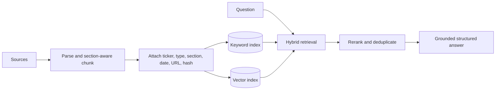

# Research agent and RAG

## Responsibility

This component interprets research questions, selects a bounded workflow, retrieves relevant company evidence, and produces structured answers grounded in deterministic market context and citations.

## Usage paradigm

Iteration 2 is a bounded workflow agent, not an unrestricted autonomous agent. LangGraph controls routing and state; LangChain supplies model, tool, retrieval, and structured-output integrations.

Supported routes include:

- explain a ticker or ranked candidate;
- compare supplied tickers;
- discover affordable CSP candidates;
- answer budget, risk, DTE, and delta questions;
- retrieve company fundamentals, catalysts, and risks;
- handle follow-up requests such as selecting a safer strike.

## Evidence sources

- SEC filings and material filing sections;
- earnings releases and investor-relations documents;
- available earnings-call transcripts;
- regulatory and legal updates;
- reputable company and industry news.

Structured prices, Greeks, ratios, dates, and technical indicators remain tool data rather than vector-store documents.

## Retrieval design

Every retrieved chunk carries ticker, document type, publication/filed date, section, source URL, retrieval time, and content hash. Claims must cite returned evidence or be labeled as inference.

## Memory evolution

- Working memory: current question, screen results, and recent turns.
- Episodic memory: previous research sessions and outcomes.
- Semantic memory: budget, risk preference, timeline, and sectors.
- Procedural memory: preferred CSP constraints and response style.

Only working memory is needed initially. Durable memory belongs to Iteration 3 and requires retention, update, and deletion controls.
